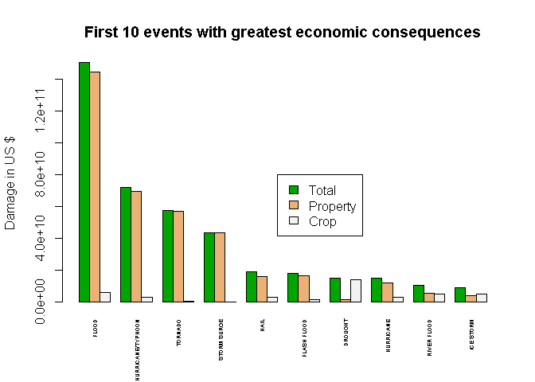

# NOAA Storm Database exploring for US healt and economic consequences due to severe weather events
Corrado Lanera  
17 giugno 2015  

## Synopsis

> Most 10 complete sentences.

In this report we aim to find the sever weather events that had the worst consequences on population healt and economic in the United State from 1950 to 2011. We based our analysis on the National Oceanic and Atmospheric Administration (NOAA) Storm Database [1]. The results of the analysis clearly identify the tornado as the most harmful event wrt population healt and the flood as the one with the greatest economic consequences. To perform the research we used the statistical program language R.

## Data Processing

### Preamble

To perform the analysis we use __R__ with the `package: dplyr`. Full code are reported below whit each explicit output. Morover the code to produce the present document is written in __R Markdown__ and can be found inside mine __GitHub__ repository [4].


```r
library(dplyr)                      # efficient tool for working with data frame
```

```
## 
## Attaching package: 'dplyr'
## 
## The following objects are masked from 'package:stats':
## 
##     filter, lag
## 
## The following objects are masked from 'package:base':
## 
##     intersect, setdiff, setequal, union
```

Final configuration of the system is:


```r
sessionInfo()         # provide principal info about configuration of the system
```

```
## R version 3.2.0 (2015-04-16)
## Platform: x86_64-w64-mingw32/x64 (64-bit)
## Running under: Windows 8 x64 (build 9200)
## 
## locale:
## [1] LC_COLLATE=Italian_Italy.1252  LC_CTYPE=Italian_Italy.1252   
## [3] LC_MONETARY=Italian_Italy.1252 LC_NUMERIC=C                  
## [5] LC_TIME=Italian_Italy.1252    
## 
## attached base packages:
## [1] stats     graphics  grDevices utils     datasets  methods   base     
## 
## other attached packages:
## [1] dplyr_0.4.2
## 
## loaded via a namespace (and not attached):
##  [1] R6_2.0.1        assertthat_0.1  magrittr_1.5    formatR_1.2    
##  [5] parallel_3.2.0  DBI_0.3.1       tools_3.2.0     htmltools_0.2.6
##  [9] yaml_2.1.13     Rcpp_0.11.6     stringi_0.4-1   rmarkdown_0.7  
## [13] knitr_1.10.5    stringr_1.0.0   digest_0.6.8    evaluate_0.7
```


### Loading \& processing the Raw Data

> Describes (in words and code) how the data were loaded into R and processed for analysis. In particular, your analysis must start from the raw CSV file containing the data. You cannot do any preprocessing outside the document. If preprocessing is time-consuming you may consider using the cache = TRUE option for certain code chunks.

From __NOAA Storm Database__ [1] we obtain data on storms and weather events in the United States, including when and where they occur, as well as estimates of any fatalities, injuries, and property damage. We obtain file from 1950 up to November 2011. Some description of the data can be found in [2] and [3].

Data are stored in the standard *comma-separated-value* format, compress with *bzip2* algorithm.


```r
download.file("http://d396qusza40orc.cloudfront.net/repdata%2Fdata%2FStormData.csv.bz2",
              "storm.data.bz2")                              # download raw data

storm.data <- read.csv(                                      # read csv from the
                bzfile("storm.data.bz2", "r"))            # compressed .bz2 file
```

### Reading \& selecting data

After loading data we have created the table to visualize information in a useful way (thanks to `package: dplyr`). 
Next we convert names in *compatibility names* both for R and for applications which do not allow *underline* in names.


```r
storm <- tbl_df(storm.data)                       # create useful table for data

names(storm) <- make.names(names(storm), allow_ = FALSE)   # compatibility names

storm                                                     # read the data tables
```

```
## Source: local data frame [902,297 x 37]
## 
##    STATE..           BGN.DATE BGN.TIME TIME.ZONE COUNTY COUNTYNAME STATE
## 1        1  4/18/1950 0:00:00     0130       CST     97     MOBILE    AL
## 2        1  4/18/1950 0:00:00     0145       CST      3    BALDWIN    AL
## 3        1  2/20/1951 0:00:00     1600       CST     57    FAYETTE    AL
## 4        1   6/8/1951 0:00:00     0900       CST     89    MADISON    AL
## 5        1 11/15/1951 0:00:00     1500       CST     43    CULLMAN    AL
## 6        1 11/15/1951 0:00:00     2000       CST     77 LAUDERDALE    AL
## 7        1 11/16/1951 0:00:00     0100       CST      9     BLOUNT    AL
## 8        1  1/22/1952 0:00:00     0900       CST    123 TALLAPOOSA    AL
## 9        1  2/13/1952 0:00:00     2000       CST    125 TUSCALOOSA    AL
## 10       1  2/13/1952 0:00:00     2000       CST     57    FAYETTE    AL
## ..     ...                ...      ...       ...    ...        ...   ...
## Variables not shown: EVTYPE (fctr), BGN.RANGE (dbl), BGN.AZI (fctr),
##   BGN.LOCATI (fctr), END.DATE (fctr), END.TIME (fctr), COUNTY.END (dbl),
##   COUNTYENDN (lgl), END.RANGE (dbl), END.AZI (fctr), END.LOCATI (fctr),
##   LENGTH (dbl), WIDTH (dbl), F (int), MAG (dbl), FATALITIES (dbl),
##   INJURIES (dbl), PROPDMG (dbl), PROPDMGEXP (fctr), CROPDMG (dbl),
##   CROPDMGEXP (fctr), WFO (fctr), STATEOFFIC (fctr), ZONENAMES (fctr),
##   LATITUDE (dbl), LONGITUDE (dbl), LATITUDE.E (dbl), LONGITUDE. (dbl),
##   REMARKS (fctr), REFNUM (dbl)
```

There were 902297 total observations with 37 variables.

The variables we are interested in are the __type of event__ (`EVTYPE`), __fatalities__ (`FATALITIES`) and __injuries__ (`INJURIES`) and those describing the __ammount of damage__ (all fields including `DMG`). Here we extract those variables and print a sample of ten cases to watch them togheter.


```r
use.storm <- storm %>%                                              # from strom
        select(EVTYPE, FATALITIES, INJURIES,         # select explicit variables
               contains("DMG"))                  # and the ones containing "DMG"

set.seed(1304)                  # set seed for reproducibility random selections
sample_n(use.storm,10)                        # print a random sample of 10 rows
```

```
## Source: local data frame [10 x 7]
## 
##               EVTYPE FATALITIES INJURIES PROPDMG PROPDMGEXP CROPDMG
## 1            TORNADO          0        1   250.0          K       0
## 2          TSTM WIND          0        0     2.0          K       0
## 3        FLASH FLOOD          0        0     0.0                  0
## 4  THUNDERSTORM WIND          0        0     8.0          K       0
## 5               HAIL          0        0     0.0                  0
## 6            TORNADO          0        0     2.5          M       0
## 7          LIGHTNING          0        0    30.0          K       0
## 8         WATERSPOUT          0        0     0.0          K       0
## 9        FLASH FLOOD          0        0     0.0          K       0
## 10         TSTM WIND          0        0     0.0                  0
## Variables not shown: CROPDMGEXP (fctr)
```


## Results


> At least one figure containing a plot.

> Figures may have multiple plots in them (i.e. panel plots), but there cannot be more than three figures total.


### Across the United States, which types of events (as indicated in the EVTYPE variable) are most harmful with respect to population health?

In order to find the most harmful event with respect to population healt we firstly select only those variable concerning the type of event, fatalities and injuries. Next we consider the total ammount of both wrt the type of event. Next we consider the sum of fatalities and injuries and rank each events according to the number of fatalities, injuries and the sum of them. Finally we show the first ten events wrt to rank of total injuries and fatalities.


```r
health.storm <- use.storm %>%                                   # from use_storm
                select(EVTYPE, FATALITIES, INJURIES) %>%  # select explicit vars
                group_by(EVTYPE) %>%         # grouped them by the type of event
                summarise_each(funs(sum)) %>% # compute the sum wrt to the group
                mutate(TOT.HARMFUL=FATALITIES + INJURIES, # create new variables
                       RK.FAT=dense_rank(desc(FATALITIES)),
                       RK.INJ=dense_rank(desc(INJURIES)),
                       RK.TOT=dense_rank(desc(TOT.HARMFUL))) %>%
                arrange(desc(TOT.HARMFUL),                 # arrange the dataset
                        desc(FATALITIES),
                        desc(INJURIES))

health.storm                                                         # show data
```

```
## Source: local data frame [985 x 7]
## 
##               EVTYPE FATALITIES INJURIES TOT.HARMFUL RK.FAT RK.INJ RK.TOT
## 1            TORNADO       5633    91346       96979      1      1      1
## 2     EXCESSIVE HEAT       1903     6525        8428      2      4      2
## 3          TSTM WIND        504     6957        7461      6      2      3
## 4              FLOOD        470     6789        7259      7      3      4
## 5          LIGHTNING        816     5230        6046      5      5      5
## 6               HEAT        937     2100        3037      4      6      6
## 7        FLASH FLOOD        978     1777        2755      3      8      7
## 8          ICE STORM         89     1975        2064     23      7      8
## 9  THUNDERSTORM WIND        133     1488        1621     15      9      9
## 10      WINTER STORM        206     1321        1527     11     11     10
## ..               ...        ...      ...         ...    ...    ...    ...
```

```r
barplot(t(as.matrix(health.storm[1:10,4:2])),# 4 interest vars of first 10 cases
        main = "First 10 most harmful events wrt polulation healt",      # title
        names.arg = health.storm$EVTYPE[1:10],     # names of the groups of bars
        las=3,                         # 90 degrees rotation only for bar lables
        cex.names = 0.45,            # magnification of lables to fit the screen
        ylab = "People death/injuried",                               # y lables
        beside = TRUE,       # grouped bars (not in a single cumulative columns)
        col = terrain.colors(3))                                  # some colours
legend(20,50000,c("Total", "Injuried", "Fatalities"),                   # legend
       fill = terrain.colors(3))           # colours of the legend: same as bars
```

 

It is clear that in all considered cases (only fatalities, only injuries or the sum of both) __tornado is the most harmful event wrt population healt__.

### Across the United States, which types of events have the greatest economic consequences?

As above, in order to find the event with the greatest economic consequences we firstly select only the variable of the dataset concerning the type of event, and the ones which report the damages ammount. More in detail we compute separately the property damage and the crop damage computing the explicit ammount of damage wrt the events. Next we rank the events wrt each of type of damage and for the total ammount of them. Finally we show the first ten events wrt to rank of total economic consequences.


```r
PROP.storm <- use.storm %>%                                     # from use_storm
                select(EVTYPE, starts_with("PROP")) %>%   # select explicit vars
                group_by(EVTYPE, PROPDMGEXP) %>%    # grop by type and magnitude
                summarize(DAMAGE.SET=sum(PROPDMG)) %>%# sum wrt to the magnitude
                mutate(                     # compute explicit ammount of damage
                        PROPDAMAGE=ifelse(PROPDMGEXP=="K",              # K=10^3
                                     DAMAGE.SET*(10^3),
                                ifelse(PROPDMGEXP=="M",                 # M=10^6
                                       DAMAGE.SET*(10^6),
                                ifelse(PROPDMGEXP=="B",                 # B=10^9
                                       DAMAGE.SET*(10^9),
                                DAMAGE.SET)))) %>%        # no changes otherwise
                summarise(TOTPROPDMG=sum(PROPDAMAGE)) # comput the total ammount

CROP.storm <- use.storm %>%                                   # similar as above
                select(EVTYPE, starts_with("CROP")) %>%
                group_by(EVTYPE, CROPDMGEXP) %>% 
                summarize(DAMAGE.SET=sum(CROPDMG)) %>% 
                mutate(CROPDAMAGE=ifelse(CROPDMGEXP=="K",
                                     DAMAGE.SET*(10^3),
                                ifelse(CROPDMGEXP=="M",
                                       DAMAGE.SET*(10^6),
                                ifelse(CROPDMGEXP=="B",
                                       DAMAGE.SET*(10^9),
                                DAMAGE.SET)))) %>%
                summarise(TOTCROPDMG=sum(CROPDAMAGE))

DMG.storm <- full_join(PROP.storm,CROP.storm) %>%                # join datasets
                mutate(TOTDMG=TOTPROPDMG + TOTCROPDMG,     # comput total damage
                       RK.PROP=dense_rank(desc(TOTPROPDMG)),         # and ranks
                       RK.CROP=dense_rank(desc(TOTCROPDMG)),
                       RK.DMG=dense_rank(desc(TOTDMG))) %>%
                arrange(desc(TOTDMG))            # arrange wrt the global damage
```

```
## Joining by: "EVTYPE"
```

```r
DMG.storm %>% print(width = Inf)                       # show data with all vars
```

```
## Source: local data frame [985 x 7]
## 
##               EVTYPE   TOTPROPDMG  TOTCROPDMG       TOTDMG RK.PROP RK.CROP
## 1              FLOOD 144657709807  5661968450 150319678257       1       2
## 2  HURRICANE/TYPHOON  69305840000  2607872800  71913712800       2       7
## 3            TORNADO  56925660790   414953270  57340614060       3      17
## 4        STORM SURGE  43323536000        5000  43323541000       4      92
## 5               HAIL  15727367053  3025537890  18752904943       6       5
## 6        FLASH FLOOD  16140812067  1421317100  17562129167       5       8
## 7            DROUGHT   1046106000 13972566000  15018672000      23       1
## 8          HURRICANE  11868319010  2741910000  14610229010       7       6
## 9        RIVER FLOOD   5118945500  5029459000  10148404500      11       3
## 10         ICE STORM   3944927860  5022113500   8967041360      15       4
## ..               ...          ...         ...          ...     ...     ...
##    RK.DMG
## 1       1
## 2       2
## 3       3
## 4       4
## 5       5
## 6       6
## 7       7
## 8       8
## 9       9
## 10     10
## ..    ...
```

```r
barplot(t(as.matrix(DMG.storm[1:10,c(4,2,3)])),          # as the previusly plot
        main = "First 10 events with greatest economic consequences",
        names.arg = DMG.storm$EVTYPE[1:10],
        las=3,
        cex.names = 0.45,
        ylab = "Damage in US $",
        beside = TRUE,
        col = terrain.colors(3))
legend(20,80000000000,c("Total", "Property", "Crop"),
       fill = terrain.colors(3))
```

 

As in the case of population healt it is one events that clearly is the worst one. In this case it is not the tornado (which reach the 3^rd^ position) but the _Flood is the events with the greatest economic consequences_.

## References

[1] Storm Data [47Mb]

https://d396qusza40orc.cloudfront.net/repdata%2Fdata%2FStormData.csv.bz2

[2] National Weather Service Storm Data Documentation.

https://d396qusza40orc.cloudfront.net/repdata%2Fpeer2_doc%2Fpd01016005curr.pdf

[3] National Climatic Data Center Storm Events FAQ.

https://d396qusza40orc.cloudfront.net/repdata%2Fpeer2_doc%2FNCDC%20Storm%20Events-FAQ%20Page.pdf

[4] This assessment Git repo.

https://github.com/CorradoL/RepData_PeerAssessment2
